# DEPI DevOps Project for Three-Tier Application on AWS with CI/CD

## Index

- [System Architecture Overview](#1--system-architecture-overview)
- [Project Code Files Tree Structure](#2--project-code-files-tree-structure)
- [Tools & Code Files Structure Preparation](#3--tools--code-files-structure-preparation)
- [Local Development & Testing](#4--local-development--testing)
- [Terraform](#5--terraform)
- [Ansible](#6--ansible)
- [Nexus (Skip if chose to use ECR)](#7--nexus-skip-if-chose-to-use-ecr)
- [Jenkins](#8--jenkins)  


## 1- System Architecture Overview

This project implements a **DevOps pipeline on AWS** using:

- **GitHub** → Source code repository and version control.
- **Docker** → Containerization of backend, frontend, and database services.
- **Kubernetes (EKS)** → Orchestration of application workloads.
- **Nexus / ECR** → Container registry for storing Docker images.
- **Terraform** → Infrastructure provisioning (**EC2, ECR, EKS & VPC**).
- **Ansible** → Configuration management and automation (installing **Nexus & Jenkins**).
- **Jenkins** → CI/CD pipeline automation.  

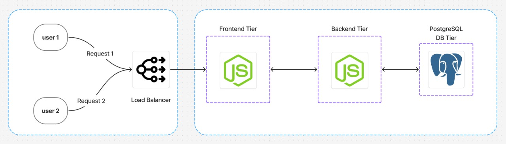
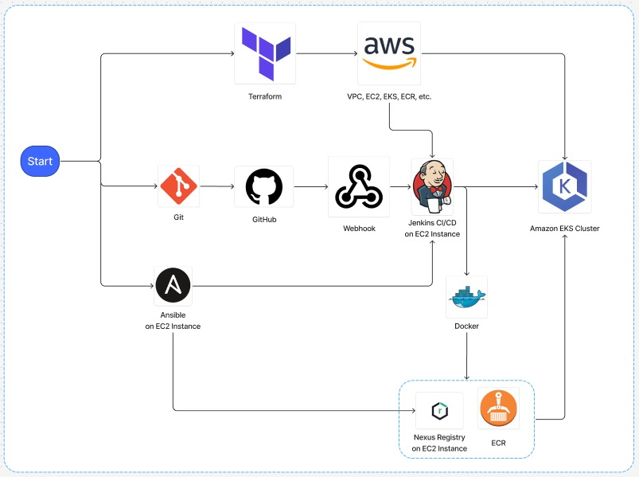
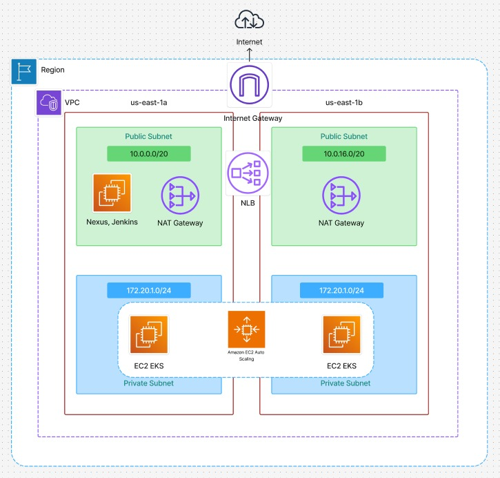


## 2- Project Code Files Tree Structure:

```
ansible
  nexus/
    tasks/
	  main.yaml
  nexus-rollback/
    tasks/
	  main.yaml
  tools/
    tasks/
      main.yaml
  tools-rollback/
    tasks/
      main.yaml
  inventory.ini
  playbook.yaml
  uninstall.yaml  
app/	
  backend/
    Dockerfile
	package.json
    server.js
  database/
    init.sql
  frontend/
    Dockerfile
    index.html
	package.json
    server.js
images/
infra/
  terraform/
    modules/
	  ec2/
	    main.tf
		outputs.tf
		variables.tf
	  ecr/
	    main.tf
		outputs.tf
		variables.tf
	  eks/
	    main.tf
		outputs.tf
		variables.tf
	  vpc/
	    main.tf
		outputs.tf
		variables.tf	
    main.tf
	outputs.tf
	providers.tf
	terraform.tfvars
	variables.tf
jenkins/
  Jenkinsfile
  Jenkinsfile(ECR)
k8s/
  backend-deployment.yaml
  backend-service.yaml
  db-configmap.yaml
  db-deployment.yaml
  db-service.yaml
  frontend-deployment.yaml
  frontend-service.yaml
docker-compose.yml
```  


## 3- Tools & Code Files Structure Preparation:

Local environment requirements: **WSL with Ubuntu OS + Docker Desktop (with Kubernetes enabled).**

Tools/Application requirements: **Git + Docker + Docker Compose + Kubectl + AWS CLI + Terraform + Ansible.**

### Steps:

*** **From WSL Terminal** ***

Update the packages 
```bash 
$ sudo apt update && sudo apt upgrade -y  
```

Install the core packages  
```bash
$ sudo apt install -y ca-certificates curl gnupg lsb-release build-essential unzip apt-transport-https  
```

Install **Git** (Already exist on Ubuntu OS)  

Configure Git user  
```bash
$ git config --global user.name "Ahmed Essam"  
$ git config --global user.email "ae@hotmail.com"  
```

Verify  
```bash
$ git config --global --list  
```

Create SSH key & add it to ssh-agent  
```bash
$ ssh-keygen -t ed25519 -C "ae@hotmail.com"  
$ eval "$(ssh-agent -s)"  
$ ssh-add ~/.ssh/id_ed25519  
```

Copy the public key content  
```bash
$ cat ~/.ssh/id_ed25519.pub  
```

*** **From GitHub Webpage** ***

Paste the key to the GitHub account under: **Account Settings → SSH and GPG keys -> New SSH key**  
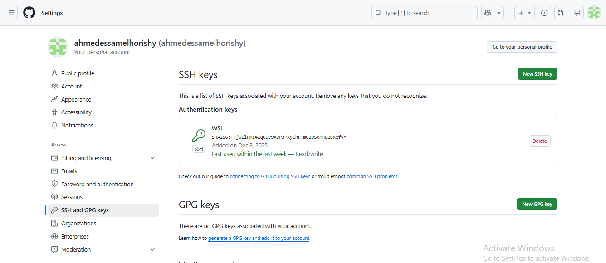

Create GitHub public repository 'DevOps-Graduation-Project'

*** **From WSL Terminal** ***

Verify  
```bash
$ ssh -T git@github.com  
```

Install **Docker** (Already exist on WSL with Docker Desktop up & running)  

Verify  
```bash
$ docker --version  
```

Install **Docker Compose** (Already exist on WSL with Docker Desktop up & running)  
```bash
$ docker compose version  
```

Install **Kubectl** (Already exist on WSL with Docker Desktop up & running with Kubernetes enablement)  
$ kubectl version --client  

Install **AWS CLI**
```bash
$ curl "https://awscli.amazonaws.com/awscli-exe-linux-x86_64.zip" -o "awscliv2.zip"  
$ unzip awscliv2.zip  
$ sudo ./aws/install  
```

Verify
```bash
$ aws --version  
```

*** **From AWS UI** ***

***Note:*** Activate "IAM user and role access to Billing information" setting  

Add IAM user 'ahmedessam' with policies 'AdministratorAcces's & 'Billing permissions'  
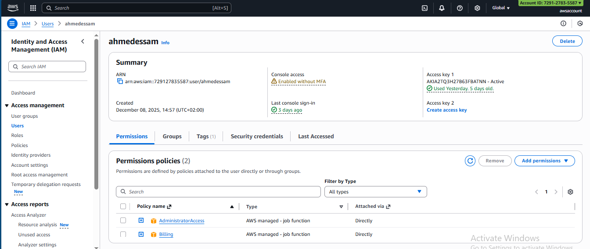

Create access key for the IAM user  


*** **From WSL Terminal** ***

Paste the AWS IAM user access key ID & secret access key, set the default region to 'us-east-1' & the default output format to 'json' 
```bash 
$ aws configure  
```

Verify  
```bash
$ aws sts get-caller-identity  
```

Install **Terraform**  
```bash
$ wget -O - https://apt.releases.hashicorp.com/gpg | sudo gpg --dearmor -o /usr/share/keyrings/hashicorp-archive-keyring.gpg  
$ echo "deb [arch=$(dpkg --print-architecture) signed-by=/usr/share/keyrings/hashicorp-archive-keyring.gpg] https://apt.releases.hashicorp.com $(grep -oP '(?<=UBUNTU_CODENAME=).*' /etc/os-release || lsb_release -cs) main" | sudo tee /etc/apt/sources.list.d/hashicorp.list  
$ sudo apt install terraform  
```

Verify  
```bash
$ terraform --version  
```

Install **Ansible**  
```bash
$ sudo apt install ansible  
```

Verify  
```bash
$ ansible --version  
```

Create the code files structure, initialize the Git repo & add the remote origin  
```bash
$ mkdir -p ~/devops  
$ cd ~/devops  
$ mkdir -p ansible/nexus/tasks/ ansible/nexus-rollback/tasks/ ansible/tools/tasks/ ansible/tools-rollback/tasks/  
$ mkdir -p app/backend app/database app/frontend  
$ mkdir -p images  
$ mkdir -p infra/terraform  
$ mkdir -p jenkins  
$ mkdir -p k8s  

$ git init  
$ git remote add origin git@github.com:ahmedessamelhorishy/DevOps-Graduation-Project.git  
```

Verify  
```bash
$ git remote -v  
```

Stage, commit & push the code files to GitHub repository  
```bash
$ git add .  
$ git commit -m "initialize repository structure"  
$ git push -u origin main  
```


## 4- Local Development & Testing:

*Local testing using **Docker***

### Steps:

*** **From WSL Terminal** ***

Build the backend Docker image  
```bash
$ cd ~/devops  
$ docker build -t backend:latest ./app/backend  
```

Build the frontend Docker image  
```bash
$ docker build -t frontend:latest ./app/frontend  
```

Verify  
```bash
$ docker images  
```

Create a custom Docker network for the services communications  
```bash
$ docker network create my-app-net  
```

Verify  
```bash
$ docker network ls  
```

Run the database container  
```bash
$ docker run -d --name db --network my-app-net -e POSTGRES_USER=postgres -e POSTGRES_PASSWORD=postgres -e POSTGRES_DB=mydb -v "$(pwd)/app/database:/docker-entrypoint-initdb.d" postgres:15  
```

Run the backend container  
```bash
$ docker run -d --name backend --network my-app-net backend:latest  
```

Run the frontend container  
```bash
$ docker run -d --name frontend --network my-app-net -p 3000:3000 frontend:latest  
```

Verify  
```bash
$ docker ps  
```

*** **From Any Browser** ***

Open the app frontend webpage: **http://localhost:3000**  
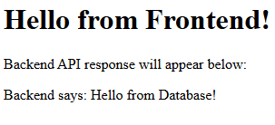

Stopping the frontend container only  


Stopping the backend container only  


Stopping the database container only  


Cleanup  
```bash
$ docker stop frontend backend db  
$ docker rm frontend backend db  
$ docker network rm my-app-net
$ docker rmi frontend:latest
$ docker rmi backend:latest
$ docker rmi postgres:15
```
---

*Local testing using **Docker Compose***

### Steps:

*** **From WSL Terminal** ***

**Docker Compose** build & test  
```bash
$ docker compose up --build  
```  

*** **From Another WSL Terminal** ***

Verify  
```bash
$ docker ps  
```

*** **From Any Browser** ***

Open the application frontend webpage: **http://localhost:3000** 

Cleanup  
```bash
$ docker compose down --rmi all  
```
---

*Local testing using **Kubernetes provisioned by Kind on Docker Desktop***

***Notes:***

a- In case need to test with NodePort instead of LoadBalancer service type  
```bash
$ kubectl port-forward service/frontend 3000:3000  
```

b- Remove below blocks from db-deployment.yaml, backend-deployment.yaml & frontend-deployment.yaml

```
imagePullSecrets: 
- name: nexus-secret 
```

c- Set below container images in db-deployment.yaml, backend-deployment.yaml & frontend-deployment.yaml respectively

```
containers:
- name: db
  image: postgres:15 
  
containers:
- name: backend
  image: backend:latest
  
containers:
- name: frontend
  image: frontend:latest 
```

### Steps:

*** **From WSL Terminal** ***

Build the Docker images and apply the Kubernetes workload
```bash
$ docker build -t backend:latest ./app/backend
$ docker build -t frontend:latest ./app/frontend
$ kubectl create namespace devops
$ kubectl apply -f k8s/ -n devops
```

Verify
```bash
$ kubectl get all -n devops
```

*** **From Any Browser** ***

Open the application frontend webpage: **http://localhost:3000**


Cleanup
```bash
$ kubectl delete -f k8s/ -n devops
$ kubectl delete namespace devops
$ docker rmi frontend:latest
$ docker rmi backend:latest
$ docker rmi postgres:15
```


## 5- Terraform:

*Configuring: **AWS EC2** instance + **ECR** private repository + **EKS** cluster + **VPC** services*

***Notes:*** 

a- Check the supported **EC2** instance types for the AWS Free Tier account
```bash
$ aws ec2 describe-instance-types --filters Name=free-tier-eligible,Values=true --query "InstanceTypes[*].InstanceType" --output text
```
b- **ECR** is a container registry option (Skip **ECR** if chose to use **Nexus** by removing the 'modules/ecr' directory & below blocks):

main.tf
```
}

module "ecr" {
  source       = "./modules/ecr"
  project_name = var.project_name
}
```  

outputs.tf
```
output "ecr_repository_url" {
  value = module.ecr.repository_url
}
```

c- Terraform variables
```
aws_region 'us-east-1
project_name 'devops-gp'
eks_version '1.29'
public_key_path '~/.ssh/id_ed25519.pub'
ec2_instance_type 'm7i-flex.large'
node_instance_type 't3.small'
az_count '2'
```

d- Terraform outputs
```
eks_cluster_name 'devops-gp-eks'
ecr_repository_url
tools_public_ip
```

### Steps:

*** **From WSL Terminal** ***

Initialize Terraform
```bash
$ cd ~/devops/infra/terraform/
$ terraform init
```

Validate the configuration, syntax & format
```bash
$ terraform validate
$ terraform fmt
```

Preview the plan changes
```bash
$ terraform plan -out tfplan
```

Apply the plan changes & review the outputs
```bash
$ terraform apply tfplan
```

Verify
```bash
$ cp ~/.kube/config ~/.kube/config.bak
$ aws eks update-kubeconfig --name $(terraform output -raw eks_cluster_name) --region $(terraform output -raw aws_region)
$ kubectl config get-contexts
$ kubectl get nodes
$ ssh -i ~/.ssh/id_ed25519 ubuntu@$(terraform output -raw tools_public_ip)
```   

*** **From AWS Webpage** ***

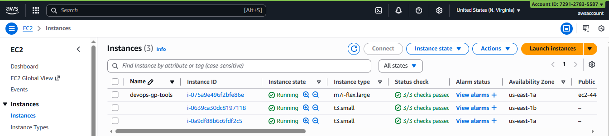
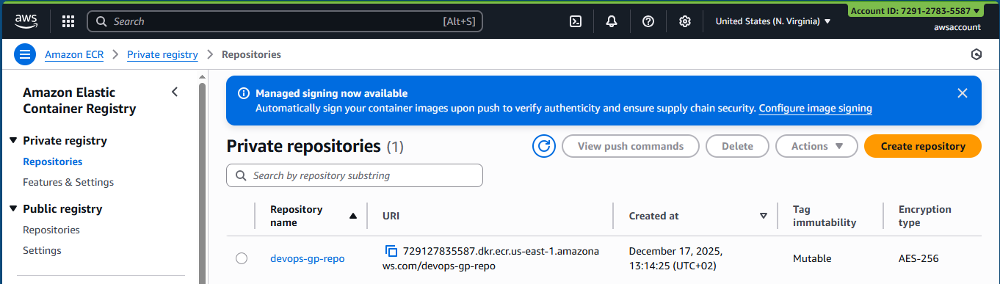
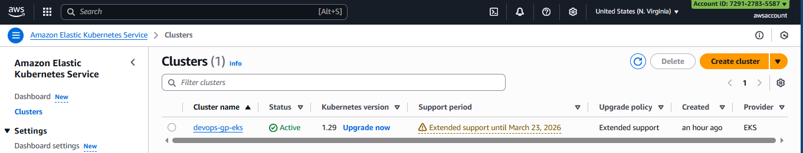
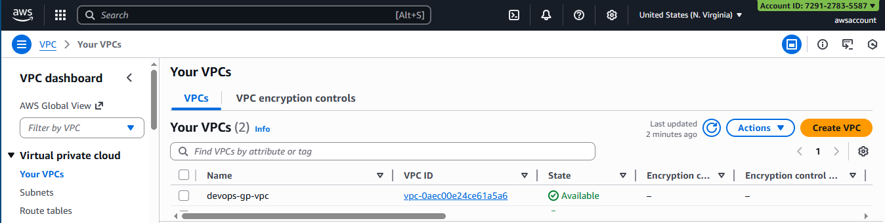
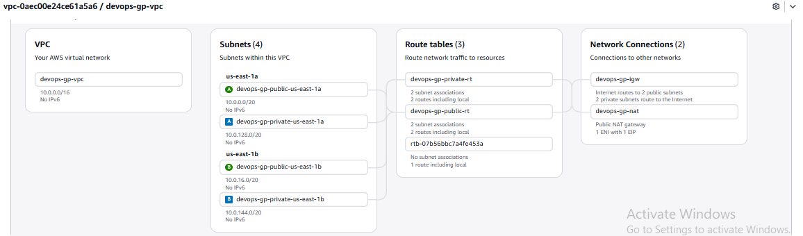
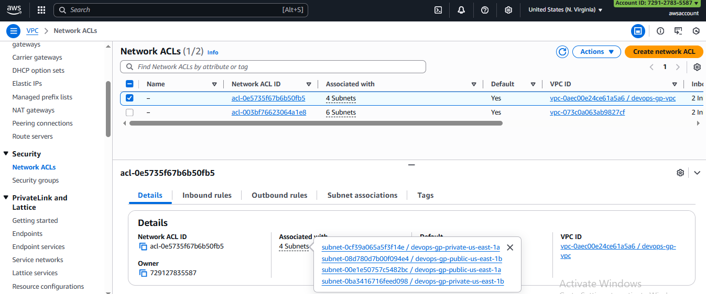  

Cleanup
```bash
$ terraform plan -destroy -out tfdestroyplan
$ terraform apply tfdestroyplan
$ rm terraform.tfstate
$ rm terraform.tfstate.backup
$ rm tfdestroyplan
$ rm tfplan
$ rm ~/.kube/config
$ cp ~/.kube/config.bak ~/.kube/config
```


## 6- Ansible:

*Configuring: **Docker** + **AWS CLI** + **Kubectl** + **Jenkins** + **Nexus** tools/application on **AWS EC2** instance*

***Notes:*** 

a- **Git** (Already exist on Ubuntu OS)

b- **Nexus** is a container registry option (Skip **Nexus** if chose to use **ECR** by removing the 'nexus' directory & below line):  

playbook.yaml
```
    - nexus
```  

c- Update the inventory.ini file with the tools public ip

```
<tools_public_ip> ansible_user=ubuntu ansible_ssh_private_key_file=~/.ssh/id_ed25519
```

### Steps:

*** **From WSL Terminal** ***

Validate the syntax
```bash
$ cd ~/devops/ansible
$ ansible-playbook -i inventory.ini playbook.yaml --syntax-check
```

Run the dry check (expected to fail at the task 'Install Docker engine')
```bash
$ ansible-playbook -i inventory.ini playbook.yaml --check --diff
```

Run the playbook
```bash
$ ansible-playbook -i inventory.ini playbook.yaml
```

Verify
```bash
$ cd ~/devops/infra/terraform
$ ssh -i ~/.ssh/id_ed25519 ubuntu@$(terraform output -raw tools_public_ip)
$ docker --version
$ aws --version
$ kubectl version --client
$ jenkins --version
$ opt/nexus/bin/nexus --version
```

*** **From Any Browser** ***

Open Jenkins webpage: **http://<tools_public_ip>:8080**  

Open Nexus webpage: **http://<tools_public_ip>:8081**  

Cleanup
```bash
$ ansible-playbook -i inventory.ini uninstall.yaml
```


## 7- Nexus (Skip if chose to use ECR):

***Notes:***

a- Allow Nexus as insecure registry in the Docker daemon configuration on the AWS EC2 instance
```bash
$ cd ~/devops/infra/terraform
$ ssh -i ~/.ssh/id_ed25519 ubuntu@$(terraform output -raw tools_public_ip)
$ sudo vi /etc/docker/daemon.json
```
```
{
  "insecure-registries": ["localhost:5000"]
}
```

b- Allow Nexus as insecure registry in the Container daemon configuration on the AWS EKS worker EC2 instances
```bash
$ cd ~/devops/infra/terraform
$ scp -i ~/.ssh/id_ed25519 ~/.ssh/id_ed25519 ubuntu@$(terraform output -raw tools_public_ip):~/.ssh/id_ed25519
$ ssh -i ~/.ssh/id_ed25519 ubuntu@$(terraform output -raw tools_public_ip)
```

Connect to each AWS EKS worker EC2 instance and follow same steps
```bash
$ ssh -i ~/.ssh/id_ed25519 ec2-user@<eks_worker_ec2_private_ip> 
$ sudo vi /etc/containerd/config.toml
```
```	
[plugins."io.containerd.grpc.v1.cri".registry]
#config_path = "/etc/containerd/certs.d:/etc/docker/certs.d"
[plugins."io.containerd.grpc.v1.cri".registry.mirrors."<tools_public_ip>:5000"]
endpoint = ["http://<tools_public_ip>:5000"]
```
```bash
$ sudo systemctl restart containerd
$ sudo systemctl status containerd
$ sudo systemctl restart kubelet
$ sudo systemctl status kubelet
```

*Configuring **Nexus** user & repository* 

### Steps:

*** **From WSL Terminal** ***

Copy the admin user password
```bash
$ cd ~/devops/infra/terraform
$ ssh -i ~/.ssh/id_ed25519 ubuntu@$(terraform output -raw tools_public_ip)
$ cat /opt/sonatype-work/nexus3/admin.password
```

*** **From Nexus Webpage** ***

Open Nexus: **http://<tools_public_ip>:8081**

Use 'admin' for the Username & paste the admin user password
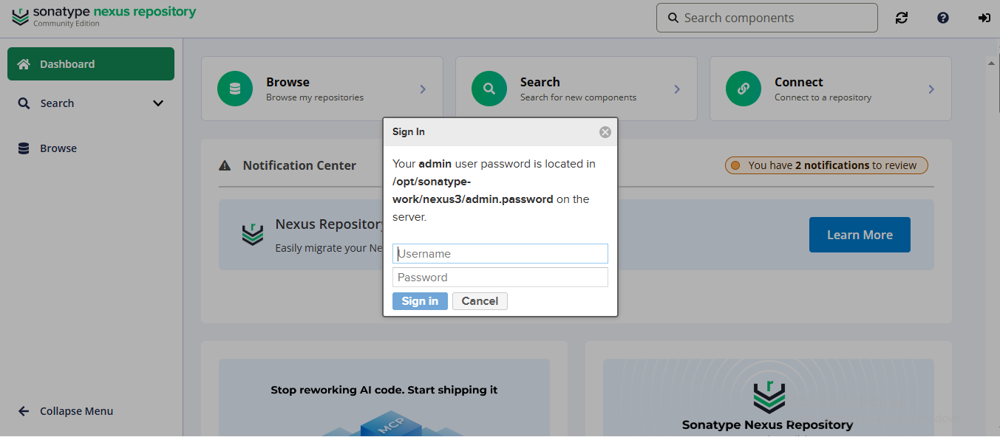


Choose a new password for the admin user


Enable anonymous access
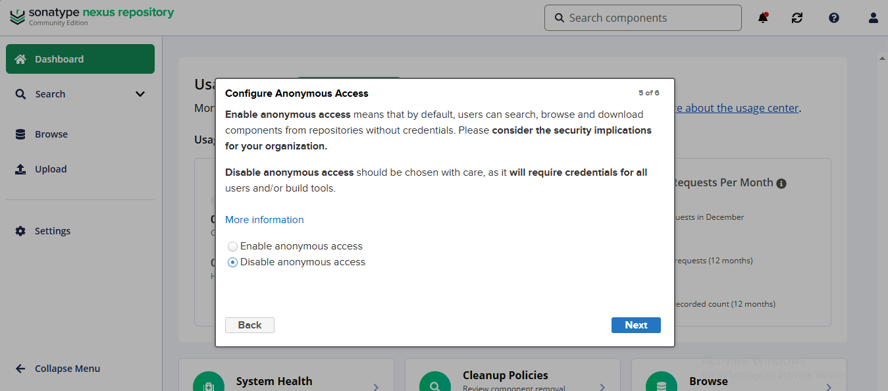

Create Nexus repository 'docker-hosted', set Online & HTTP connector to port '5000' from: **Settings -> Repository -> Repositories: Create and manage repositories -> Create repository -> Select Recipe: 'docker (hosted)'**


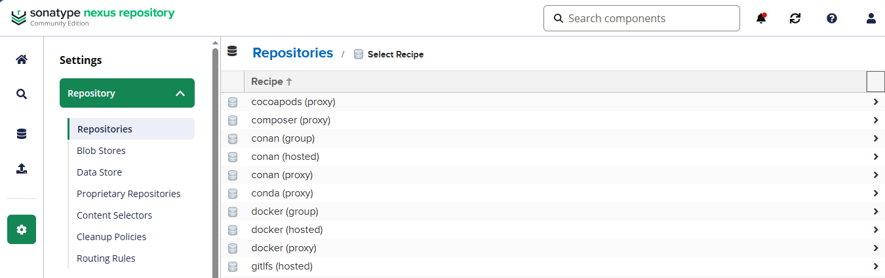
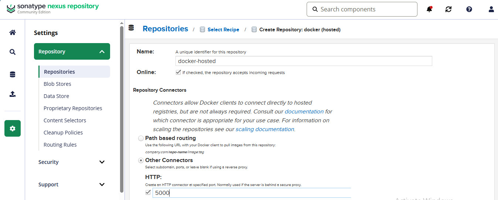
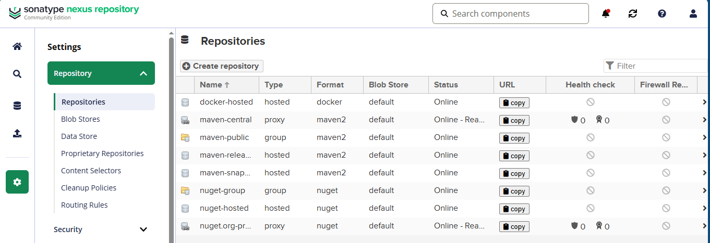

Create user 'nexus' with role 'nx-admin' from: **Settings -> Security -> Users -> Create local user**


## 8- Jenkins

*Installing & configuring **Jenkins** user, plugins, global credentials, global environment variables & pipeline*

### Steps:

*** **From WSL Terminal** ***

Copy the admin user password
```bash
$ cd ~/devops/infra/terraform
$ ssh -i ~/.ssh/id_ed25519 ubuntu@$(terraform output -raw tools_public_ip)
$ sudo cat /var/lib/jenkins/secrets/initialAdminPassword
```

*** **From Jenkins Webpage** ***

Open Jenkins webpage: **http://<tools_public_ip>:8080**

Paste the admin user password


Install suggested plugins
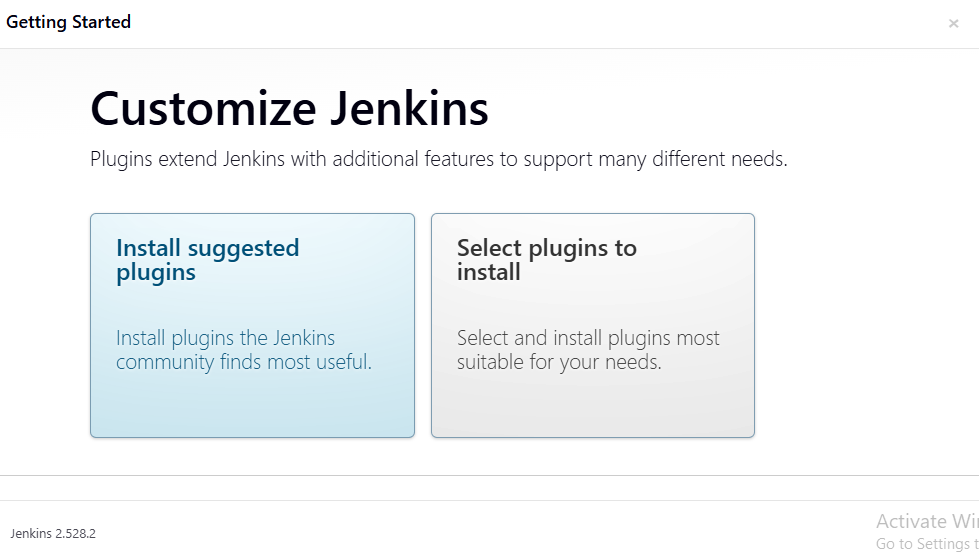

Create the admin user
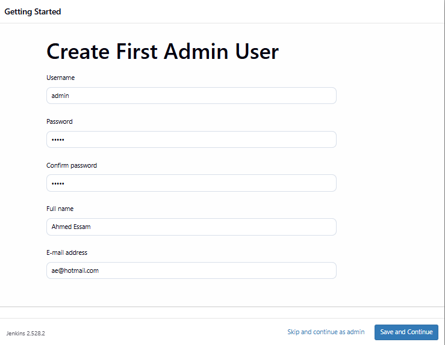

Set the Jenkins URL to: **http://<tools_public_ip>:8080/**


Install the plugins 'AWS credentials' & 'AnsiColor' from: **Settings -> System Configuration -> Plugins -> Available Plugins -> Install** 


*** **From WSL Terminal** ***

Restart Jenkins
```bash
$ sudo systemctl stop jenkins
$ sudo systemctl start jenkins
```

*** **From Jenkins Webpage** ***

Configure the global credentials 'aws-creds' (from Section 1) & 'nexus-creds'(from Section 5, skip if chose to use ECR) from: **Settings -> Security -> Credentials -> System -> Global credentials (unrestricted) -> Add Credentials** 
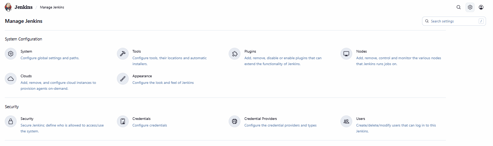
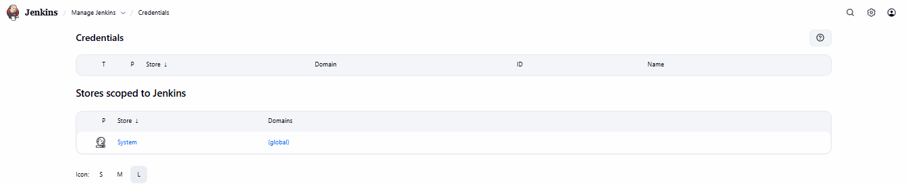


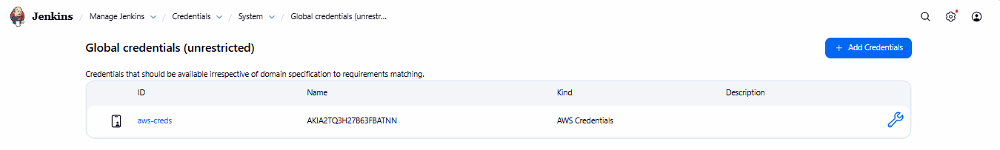
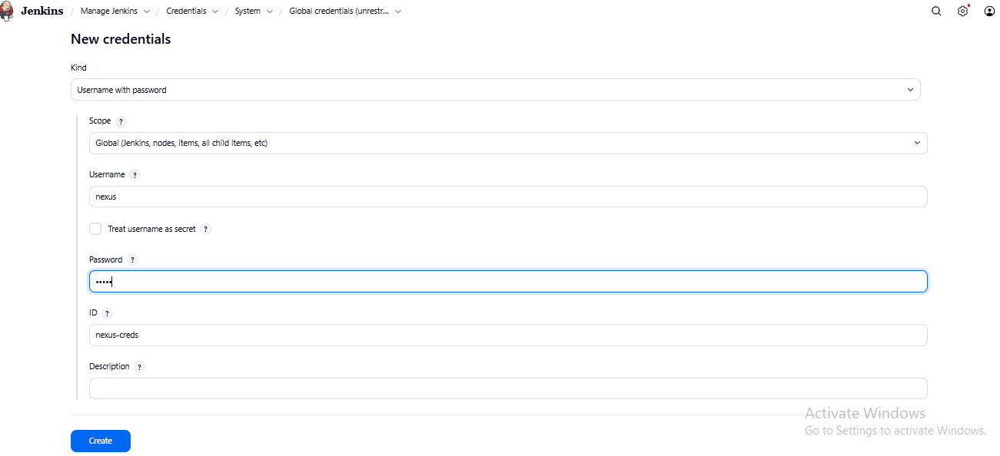


Configure the below global environment variables from: **Settings -> System Configuration -> Global properties -> Environment variables**
```
GITHUB_USERNAME 'ahmedessamelhorishy' (from Section 1)
GITHUB_REPO 'DevOps-Graduation-Project' (from Section 1)
AWS_REGION 'us-east-1' (from Section 1)
EKS_CLUSTER_NAME 'devops-gp-eks' (from Section 3)
K8S_NAMESPACE 'devops'
REGISTRY_HOST 'http://<tools_public_ip>:5000' (from Section 5 if chose to use **Nexus**) OR '729127835587.dkr.ecr.us-east-1.amazonaws.com' (from Section 3 if chose to use **ECR**)
REGISTRY_REPO_URL <tools_public_ip>:5000/repository/docker-hosted (from Section 5 if chose to use **Nexus**) OR '729127835587.dkr.ecr.us-east-1.amazonaws.com/devops-gp-repo' (from Section 3 if chose to use **ECR**)
```

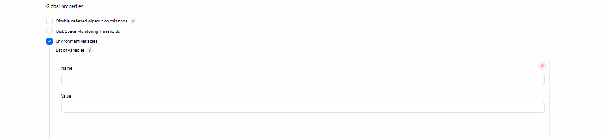

Create the pipeline with item name 'Pipeline', set Pipeline script from SCM Definition, Git SCM, Repository URL 'github.com:ahmedessamelhorishy/DevOps-Graduation-Project', Branch specifier '*/main' & Script path 'jenkins/Jenkinsfile (Nexus)' (if chose to use **Nexus**) OR 'jenkins/Jenkinsfile (ECR)' (if chose to use **ECR**)  from: **New Item**


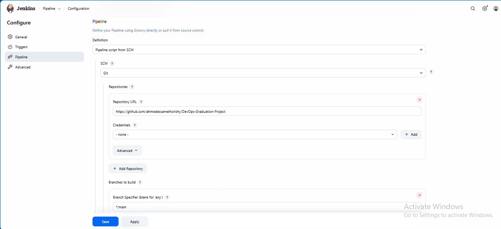

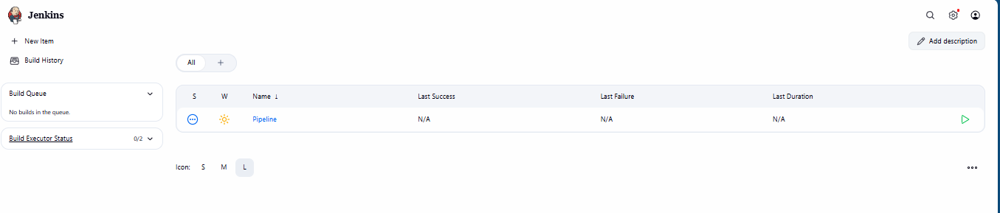

Test the pipeline build manually from: **Pipeline -> Build with Parameters -> Set DEPLOY_MANUAL -> Build**
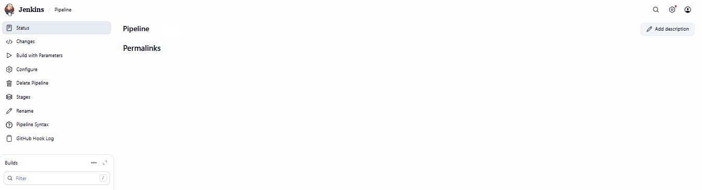
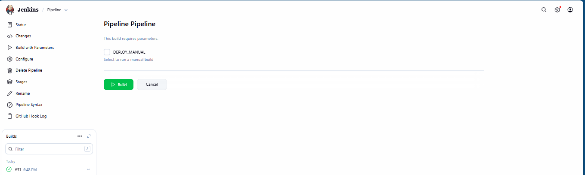  

Verify
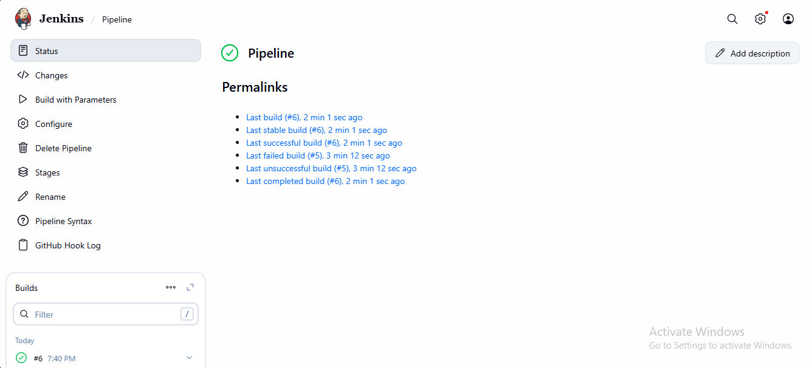  
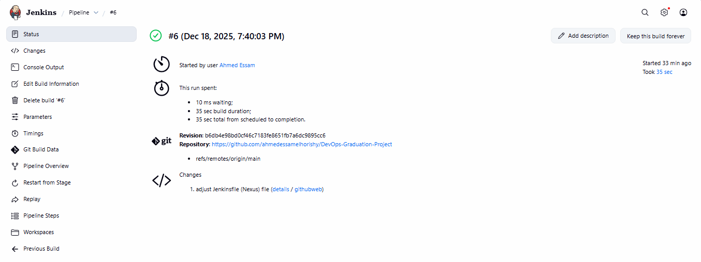

Copy the load balancer DNS name from: Pipeline -> Build -> Console Output
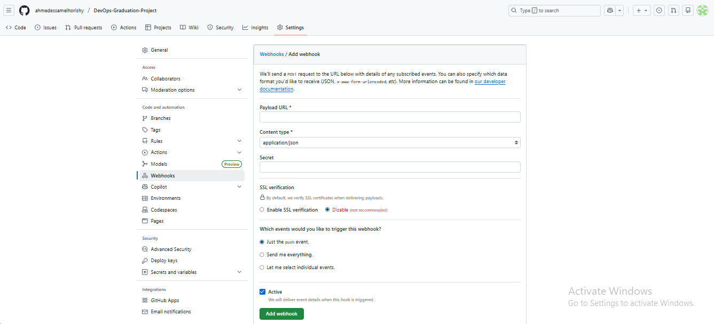  

*** **From AWS Webpage** ***

Verify (if chose to use **Nexus**)
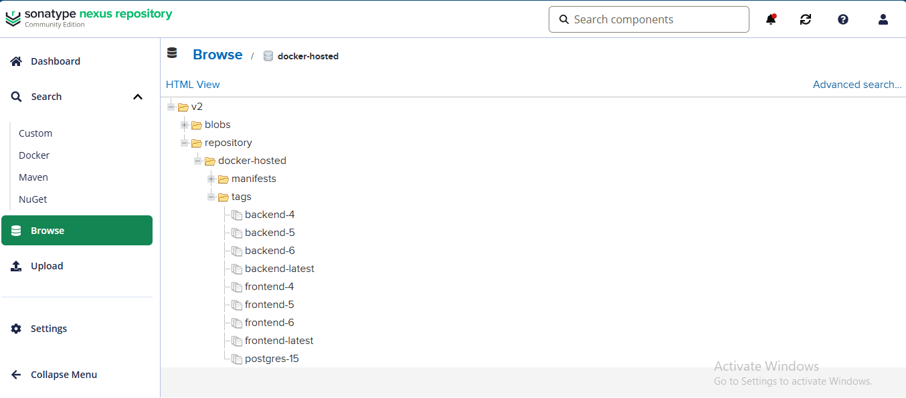  

*** **From Any Browser** ***

Paste the load balancer DNS name followed by port 3000 to open the application frontend webpage:


*** **From GitHub Webpage** ***

Configure the GitHub Webhook by seting Payload URL to 'http://<tools_public_ip>:8080/github-webhook/', Content type 'application/json' & Disable SSL verification from: **Repository Settings -> Code and automation -> Webhooks -> Add webhook**
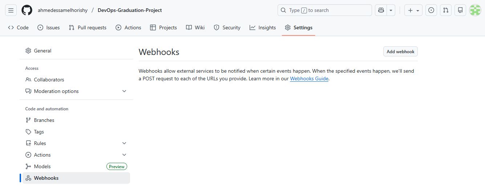
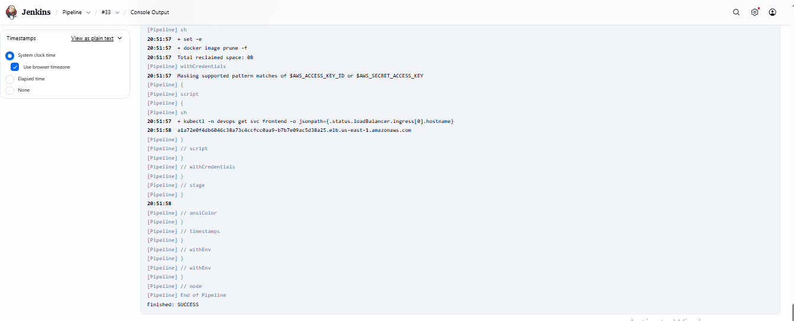
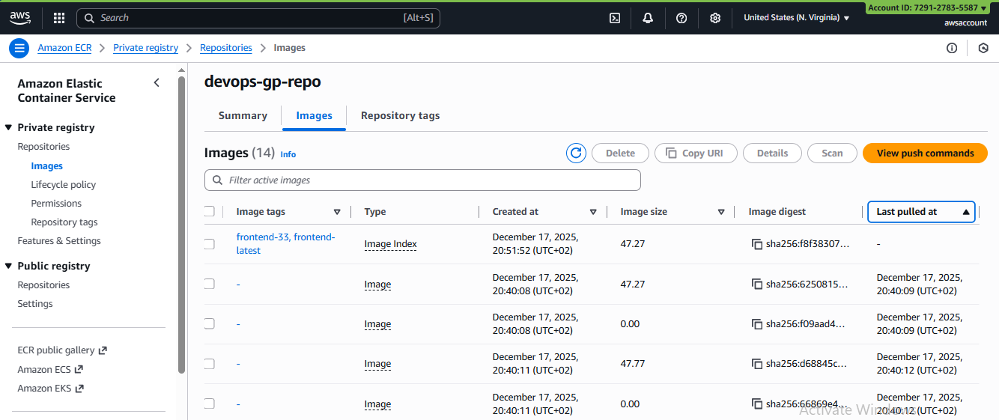  

*** **From WSL Terminal** ***

Test the pipeline build automation by doing any change in one of the application code files then stage, commit & push it to GitHub repository 
```bash
$ git add .  
$ git commit -m "adjust server.js for testing pipeline automation"  
$ git push -u origin main  
```  

*** **From Jenkins Webpage** ***

Verify
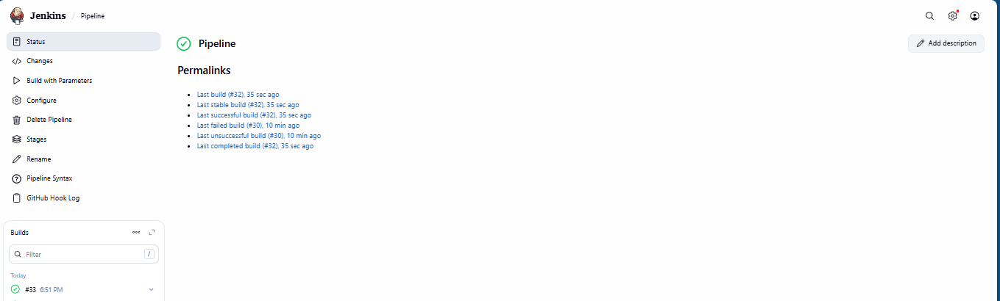
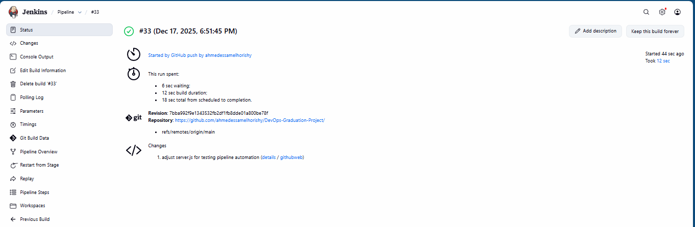

Copy the load balancer DNS name from: Pipeline -> Build -> Console Output
  

*** **From AWS Webpage** ***

Verify (if chose to use **ECR**)
  

*** **From Any Browser** ***

Paste the load balancer DNS name followed by port 3000 to open the application frontend webpage:

