# DEPI DevOps Project on AWS Using: GitHub + Terraform + Jenkins + Ansible (for Nexus)

## Quick Start

- [1- Tools & Code Files Structure Preparation](#1--tools--code-files-structure-prepartion)
- [2- Local Development & Testing](#2--local-development--testing)
- [3- Terraform](#3--terraform)
- [4- Ansible](#4--ansible)
- [5- Nexus (Skip if chose to use ECR)](#5--nexus-skip-if-chose-to-use-ecr)
- [6- Jenkins](#6--jenkins)

## Architecture Overview

This project implements a **DevOps pipeline on AWS** using:

- **GitHub** → Source code repository and version control.
- **Terraform** → Infrastructure provisioning (EC2, VPC, EKS, ECR).
- **Ansible** → Configuration management and automation (installing Docker, Jenkins, Nexus).
- **Jenkins** → CI/CD pipeline automation.
- **Nexus / ECR** → Container registry for storing Docker images.
- **Kubernetes (EKS)** → Orchestration of application workloads.
- **Docker** → Containerization of backend, frontend, and database services.

## Project Code Files Structure:

ansible ├── nexus │ └── tasks │ └── main.yaml ├── nexus-rollback │ └── tasks │ └── main.yaml ├── tools │ └── tasks │ └── main.yaml ├── tools-rollback │ └── tasks │ └── main.yaml ├── inventory.ini ├── playbook.yaml └── uninstall.yaml

app ├── backend │ ├── Dockerfile │ ├── package.json │ └── server.js ├── database │ └── init.sql └── frontend ├── Dockerfile ├── index.html ├── package.json └── server.js

infra └── terraform └── modules ├── ec2 │ ├── main.tf │ ├── outputs.tf │ └── variables.tf ├── ecr │ ├── main.tf │ ├── outputs.tf │ └── variables.tf ├── eks │ ├── main.tf │ ├── outputs.tf │ └── variables.tf └── vpc ├── main.tf ├── outputs.tf └── variables.tf

images ├── main.tf ├── outputs.tf ├── providers.tf ├── terraform.tfvars └── variables.tf

jenkins ├── Jenkinsfile └── Jenkinsfile(ECR)

k8s ├── backend-deployment.yaml ├── backend-service.yaml ├── db-configmap.yaml ├── db-deployment.yaml ├── db-service.yaml ├── frontend-deployment.yaml └── frontend-service.yaml

.gitignore docker-compose.yml README.

## 1- Tools & Code Files Structure Prepartion:

Local enviroment requirements: WSL with Ubuntu OS + Docker Desktop (with Kubernetes enabled)  
Tools/Apps requirements: Git + Docker + Docker Compose + Kubectl + AWS CLI + Terraform + Ansible

### Steps:

*** From WSL Terminal ***

Update the packages  
$ sudo apt update && sudo apt upgrade -y  

Install the core packages  
$ sudo apt install -y ca-certificates curl gnupg lsb-release build-essential unzip apt-transport-https  

Install Git (Already exist on Ubuntu OS)  

Configure Git user  
$ git config --global user.name "Ahmed Essam"  
$ git config --global user.email "ae@hotmail.com"  

Verify  
$ git config --global --list  

Create SSH key & add it to ssh-agent  
$ ssh-keygen -t ed25519 -C "ae@hotmail.com"  
$ eval "$(ssh-agent -s)"  
$ ssh-add ~/.ssh/id_ed25519  

Copy the public key content  
$ cat ~/.ssh/id_ed25519.pub  

*** From GitHub UI ***

Paste the key to the GitHub account under: Settings → SSH and GPG keys -> New SSH key  

Create GitHub public repository 'DevOps-Graduation-Project'

*** From WSL Terminal ***

Verify  
$ ssh -T git@github.com  

Install Docker (Already exist on WSL with Docker Desktop up & running)  

Verify  
$ docker --version  

Install Docker Compose (Already exist on WSL with Docker Desktop up & running)  
$ docker compose version  

Install kubectl (Already exist on WSL with Docker Desktop up & running with Kubernetes enablement)  
$ kubectl version --client  

Install AWS cli  
$ curl "https://awscli.amazonaws.com/awscli-exe-linux-x86_64.zip" -o "awscliv2.zip"  
$ unzip awscliv2.zip  
$ sudo ./aws/install  

Verify  
$ aws --version  

*** From AWS UI ***

Note: Activate "IAM user and role access to Billing information" setting  

Add IAM user 'ahmedessam' with policies 'AdministratorAcces's & 'Billing permissions'  

Create access key for the IAM user  
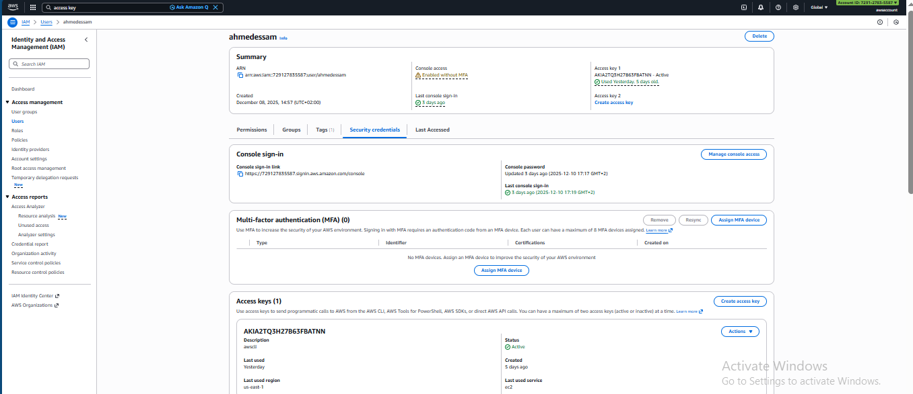

*** From WSL Terminal ***

Paste the AWS IAM user access key ID & secret access key, set the default region to 'us-east-1' & the default output format to 'json'  
$ aws configure  

Verify  
$ aws sts get-caller-identity  

Install Terraform  
$ wget -O - https://apt.releases.hashicorp.com/gpg | sudo gpg --dearmor -o /usr/share/keyrings/hashicorp-archive-keyring.gpg  
$ echo "deb [arch=$(dpkg --print-architecture) signed-by=/usr/share/keyrings/hashicorp-archive-keyring.gpg] https://apt.releases.hashicorp.com $(grep -oP '(?<=UBUNTU_CODENAME=).*' /etc/os-release || lsb_release -cs) main" | sudo tee /etc/apt/sources.list.d/hashicorp.list  
$ sudo apt install terraform  

Verify  
$ terraform --version  

Install Ansible  
$ sudo apt install ansible  

Verify  
$ ansible --version  

Create the code files structure, initialize the Git repo & add the remote origin  
$ mkdir -p ~/devops  
$ cd ~/devops  
$ mkdir -p ansible/nexus/tasks/ ansible/nexus-rollback/tasks/ ansible/tools/tasks/ ansible/tools-rollback/tasks/  
$ mkdir -p app/backend app/database app/frontend  
$ mkdir -p images  
$ mkdir -p infra/terraform  
$ mkdir -p jenkins  
$ mkdir -p k8s  

$ git init  
$ git remote add origin git@github.com:ahmedessamelhorishy/DevOps-Graduation-Project.git  

Verify  
$ git remote -v  

Stage, commit & push the code files to GitHub repository  
$ git add .  
$ git commit -m "initialize repository structure"  
$ git push -u origin main  

---

## 2- Local Development & Testing:

Local testing using Docker

### Steps:

*** From WSL Terminal ***

Build the backend Docker image  
$ cd ~/devops  
$ docker build -t backend:latest ./app/backend  

Build the frontend Docker image  
$ docker build -t frontend:latest ./app/frontend  

Verify  
$ docker images  

Create a custom Docker network for the services communications  
$ docker network create my-app-net  

Verify  
$ docker network ls  

Run the database container  
$ docker run -d --name db --network my-app-net -e POSTGRES_USER=postgres -e POSTGRES_PASSWORD=postgres -e POSTGRES_DB=mydb -v "$(pwd)/app/database:/docker-entrypoint-initdb.d" postgres:15  

Run the backend container  
$ docker run -d --name backend --network my-app-net backend:latest  

Run the frontend container  
$ docker run -d --name frontend --network my-app-net -p 3000:3000 frontend:latest  

Verify  
$ docker ps  

*** From any browser ***

Open the app frontend webpage: http://localhost:3000  

Stopping the frontend container only  
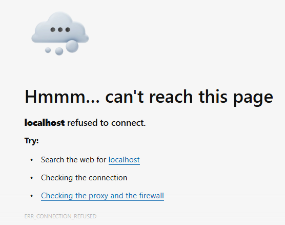

Stopping the backend container only  
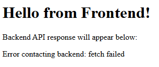

Stopping the database container only  
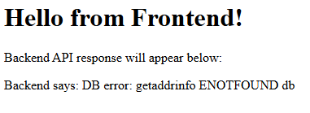

Cleanup  
$ docker stop frontend backend db  
$ docker rm frontend backend db  
$ docker network rm my-app-net  

---

Local testing using Docker Compose

### Steps:

*** From WSL Terminal ***

Docker Compose build & test  
$ docker compose up --build  

Verify  
$ docker ps  

*** From any browser ***

Open the app frontend: http://localhost:3000  

Cleanup  
$ docker compose down --rmi all  

---

Local testing using Kubernetes provisioned by Kind on Docker Desktop

Notes:

a- In case need to test with NodePort instead of LoadBalancer service type  
$ kubectl port-forward service/frontend 3000:3000  

b- Remove below blocks from db-deployment.yaml, backend-deployment.yaml & frontend-deployment.yaml

imagePullSecrets: 
- name: nexus-secret 

c- Set below container images in db-deployment.yaml, backend-deployment.yaml & frontend-deployment.yaml respectively

containers:
- name: db
  image: postgres:15 
  
containers:
- name: backend
  image: backend:latest
  
containers:
- name: frontend
  image: frontend:latest 

### Steps:

*** From WSL Terminal ***

Build the Docker images and apply the Kubernetes workload
$ docker build -t backend:latest ./app/backend
$ docker build -t frontend:latest ./app/frontend
$ kubectl create namespace devops
$ kubectl apply -f k8s/ -n devops

Verify
$ kubectl get all -n devops

*** From any browser ***

Open the app frontend: http://localhost:3000

Cleanup
$ kubectl delete -f k8s/ -n devops
$ kubectl delete namespace devops

## 3- Terraform:

Configuring: AWS EC2 instance + ECR public repository + EKS cluster + VPC services

Notes: 

a- Check the supported EC2 instance types for the AWS Free Tier account
$ aws ec2 describe-instance-types --filters Name=free-tier-eligible,Values=true --query "InstanceTypes[*].InstanceType" --output text

b- ECR is a container registry option (Skip ECR if chose to use Nexus)

c- Terraform variables:
aws_region 'us-east-1
project_name 'devops-gp'
eks_version '1.29'
public_key_path '~/.ssh/id_ed25519.pub'
ec2_instance_type 'm7i-flex.large'
node_instance_type 't3.small'
az_count '2'

d- Terraform outputs:
eks_cluster_name 'devops-gp-eks'
ecr_repository_url
tools_public_ip

### Steps:

*** From WSL Terminal ***

Initialize Terraform
$ cd ~/devops/infra/terraform/
$ terraform init

Validate the configuration, syntax & format
$ terraform validate
$ terraform fmt

Preview the plan changes
$ terraform plan -out tfplan

Apply the plan changes & review the outputs
$ terraform apply tfplan

Verify
$ cp ~/.kube/config ~/.kube/config.bak
$ aws eks update-kubeconfig --name $(terraform output -raw eks_cluster_name) --region $(terraform output -raw aws_region)
$ kubectl config get-contexts
$ kubectl get nodes
$ ssh -i ~/.ssh/id_ed25519 ubuntu@$(terraform output -raw tools_public_ip)

Cleanup
$ terraform plan -destroy -out tfdestroyplan
$ terraform apply tfdestroyplan
$ rm terraform.tfstate
$ rm terraform.tfstate.backup
$ rm tfdestroyplan
$ rm tfplan

## 4- Ansible:

Configuring: Docker + AWS CLI + Kubectl + Jenkins + Nexus tools/apps on AWS EC2 instance

Notes: 

a- Git (Already exist on Ubuntu OS)

b- Nexus is a container registry option (Skip Nexus if chose to use ECR)

### Steps:

*** From WSL Terminal ***

Validate the syntax
$ cd ~/devops/ansible
$ ansible-playbook -i inventory.ini playbook.yaml --syntax-check

Run the dry check
$ ansible-playbook -i inventory.ini playbook.yaml --check --diff

Run the playbook
$ ansible-playbook -i inventory.ini playbook.yaml

Verify
$ cd ~/devops/infra/terraform
$ ssh -i ~/.ssh/id_ed25519 ubuntu@$(terraform output -raw tools_public_ip)
$ docker --version
$ aws --version
$ kubectl version --client
$ jenkins --version
$ opt/nexus/bin/nexus --version

*** From any browser ***

Open Jenkins webpage: http://<tools_public_ip>:8080
Open Nexus webpage: http://<tools_public_ip>:8081

## 5- Nexus (Skip if chose to use ECR):

Notes:

a- Allow Nexus as insecure registry in the Docker daemon configuration on the AWS EC2 instance
$ sudo vi /etc/docker/daemon.json

{
  "insecure-registries": ["localhost:5000"]
}

b- Allow Nexus as insecure registry in the Container daemon configuration on the AWS EKS worker EC2 instances
$ cd ~/devops/infra/terraform
$ scp -i ~/.ssh/id_ed25519 ~/.ssh/id_ed25519 ubuntu@$(terraform output -raw tools_public_ip):~/.ssh/id_ed25519
$ ssh -i ~/.ssh/id_ed25519 ubuntu@$(terraform output -raw tools_public_ip)

Connect to each AWS EKS worker EC2 instance and follow same steps
$ ssh -i ~/.ssh/id_ed25519 ec2-user@<eks_worker_ec2_private_ip> 
$ sudo vi /etc/containerd/config.toml
	
[plugins."io.containerd.grpc.v1.cri".registry]
#config_path = "/etc/containerd/certs.d:/etc/docker/certs.d"
[plugins."io.containerd.grpc.v1.cri".registry.mirrors."<tools_public_ip>:5000"]
endpoint = ["http://<tools_public_ip>:5000"]

sudo systemctl restart containerd
sudo systemctl status containerd
sudo systemctl restart kubelet
sudo systemctl status kubelet

Configuring Nexus user & repository 

### Steps:

*** From WSL Terminal ***

Copy the admin user password
$ cd ~/devops/infra/terraform
$ ssh -i ~/.ssh/id_ed25519 ubuntu@$(terraform output -raw tools_public_ip)
$ cat /opt/sonatype-work/nexus3/admin.password

*** From Nexus webpage ***

Open Nexus: http://<tools_public_ip>:8081

Use 'admin' for the Username & paste the admin user password

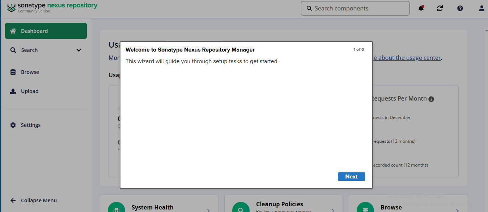

Choose a new password for the admin user
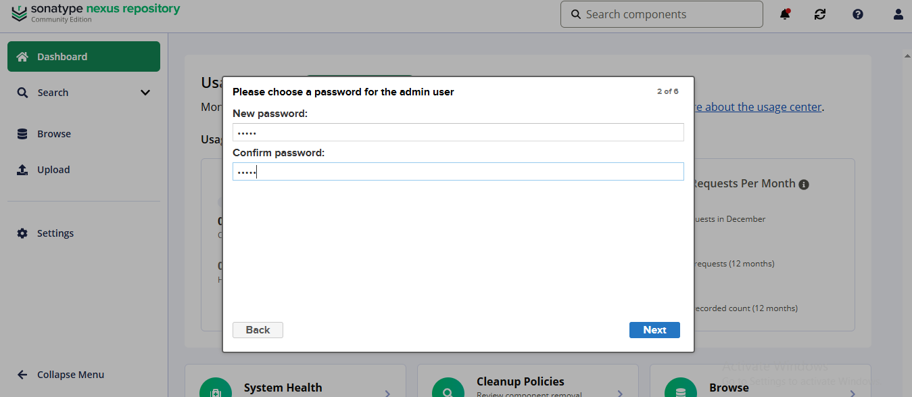

Enable anonymous access
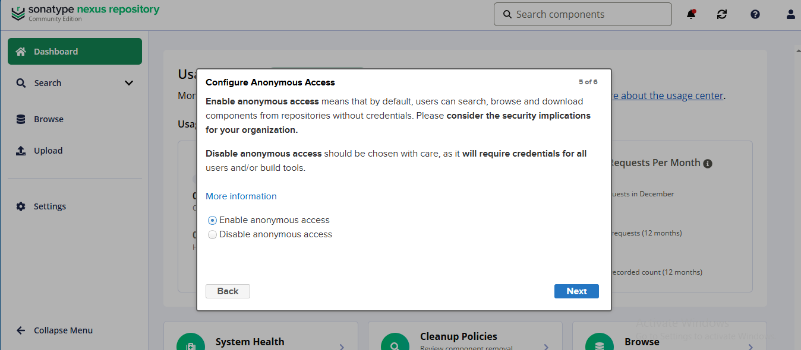

Create Nexus repository 'docker-hosted', set Online & HTTP connector to port '5000' from: Settings -> Repository -> Repositories: Create and manage repositories -> Create repository -> Select Recipe: 'docker (hosted)'
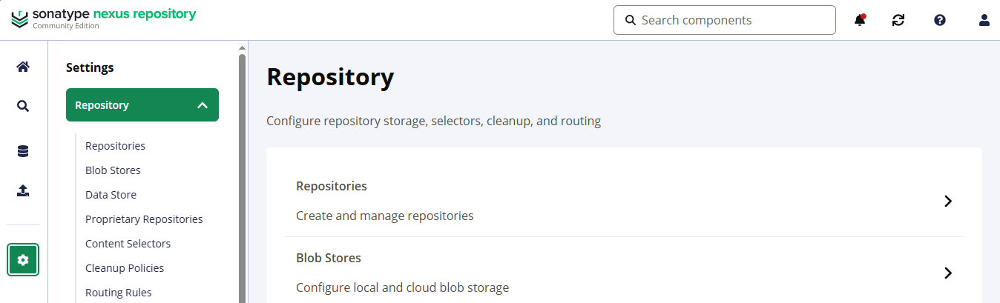
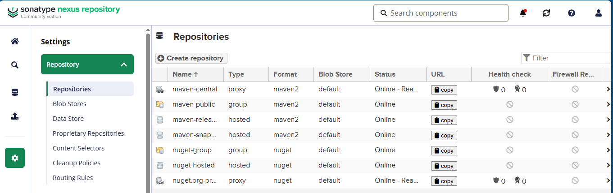

Create user 'nexus' with role 'nx-admin' from: Settings -> Security -> Users -> Create local user
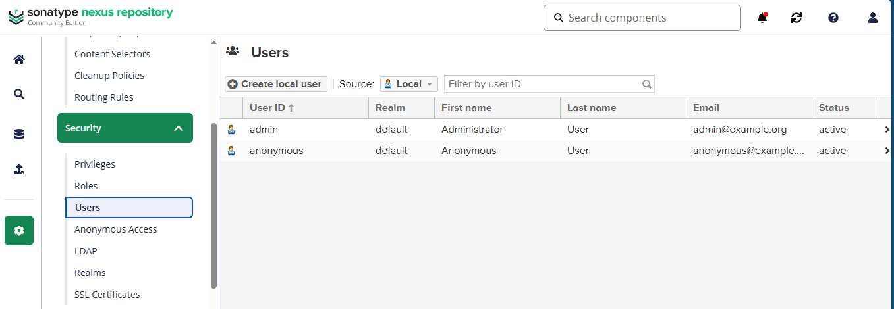
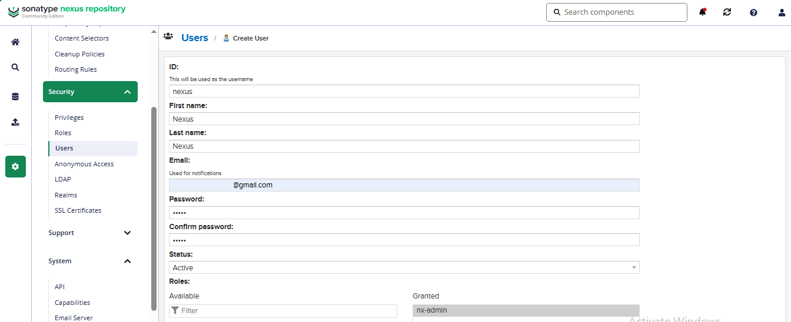
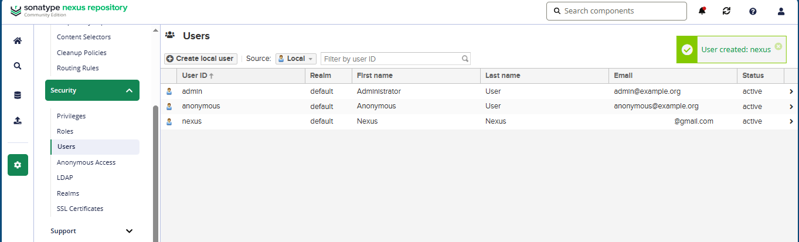

## 6- Jenkins

Installing & configuring Jenkins user, plugins, global credentials, global environment variables & pipeline

### Steps:

*** From WSL Terminal ***

Copy the admin user password
$ sudo cat /var/lib/jenkins/secrets/initialAdminPassword

*** From Jenkins webpage ***

Open Jenkins webpage: http://<tools_public_ip>:8080

Paste the admin user password
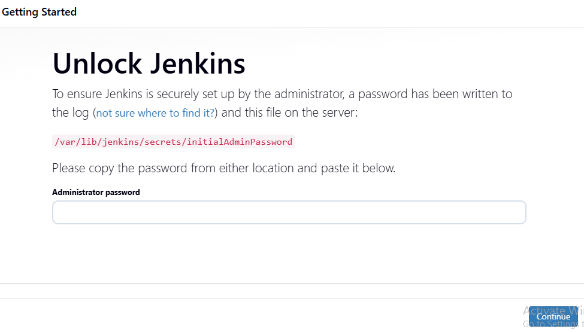

Install suggested plugins

Create the admin user

Set the Jenkins URL to 'http://<tools_public_ip>:8080'

Install the plugins 'AWS credentials' & 'AnsiColor' from: Settings -> System Configuration -> Plugins -> Install 
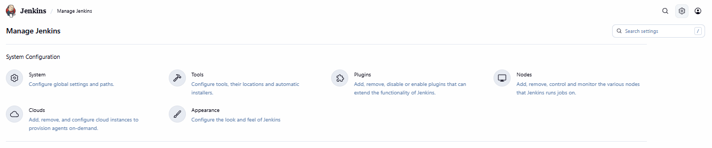
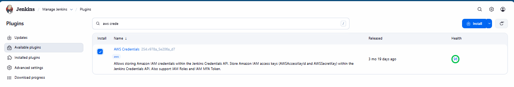
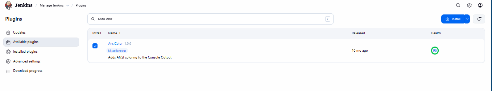

*** From WSL Terminal ***

Restart Jenkins
$ sudo systemctl stop jenkins
$ sudo systemctl start jenkins

*** From Jenkins webpage ***

Configure the global credentials 'aws-creds' (from Section 1) & 'nexus-creds'(from Section 5, skip if chose to use ECR) from: Settings -> Security -> Credentials -> System -> Global credentials (unrestricted) -> Add Credentials 

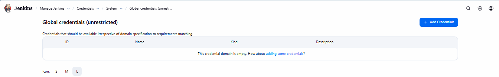
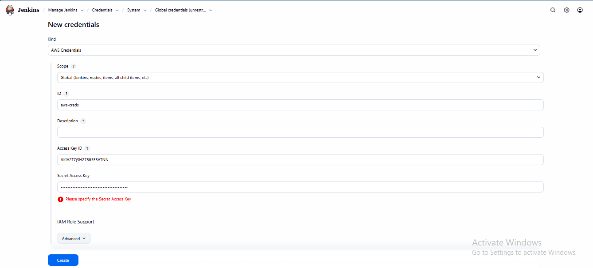

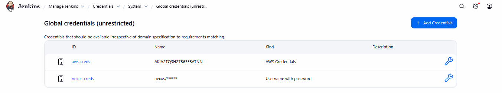

Configure the below global environment variables from: Settings -> System Configuration -> Global properties -> Environment variables

GITHUB_USERNAME 'ahmedessamelhorishy' (from Section 1)
GITHUB_REPO 'DevOps-Graduation-Project' (from Section 1)
AWS_REGION 'us-east-1' (from Section 1)
EKS_CLUSTER_NAME 'devops-gp-eks' (from Section 3)
K8S_NAMESPACE 'devops'
ECR_PUBLIC_URI (from Section 3, skip if chose to use Nexus)
NEXUS_HOST 'http://<tools_public_ip>:5000' (from Section 5, skip if chose to use ECR) 
NEXUS_REGISTRY <tools_public_ip>:5000/repository/docker-hosted (from Section 5, skip if chose to use ECR) 

Create the pipeline with item name 'Pipeline', set Pipeline script from SCM Definition, Git SCM, Repository URL 'github.com:ahmedessamelhorishy/DevOps-Graduation-Project', Branch specifier '*/main' & Script path 'jenkins/Jenkinsfile' 

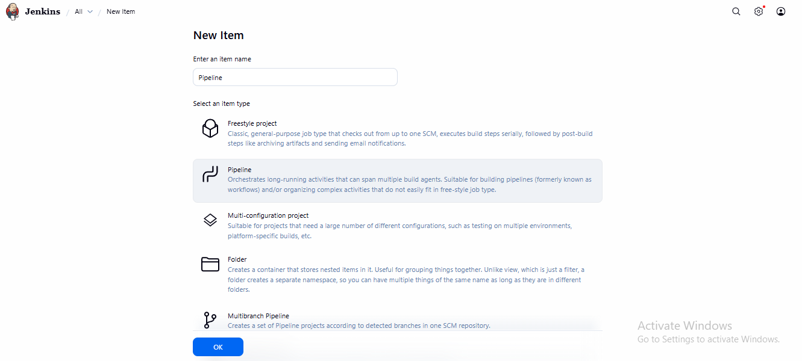

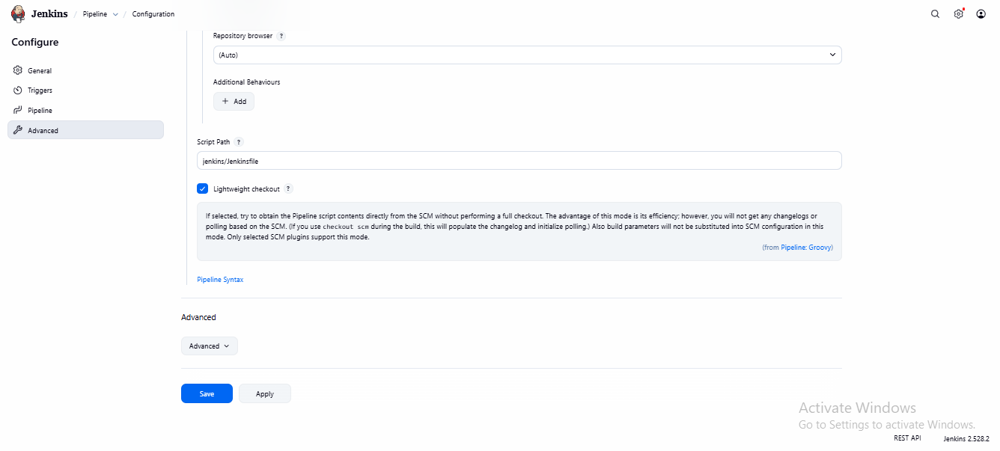

